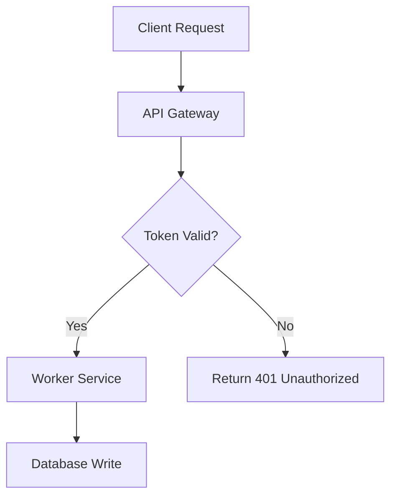

# ASD-STE100: Simplified Technical English & 80% Pragmatic Mode

A comprehensive skill for generating, transforming, and validating technical content using **ASD-STE100 (Simplified Technical English, Issue 9, January 2025)** and Andrej Karpathy's **"80% Pragmatic Mode"**.

> *"Writing. Something I've had success with: Ask your LLM to explain something in ASD-STE100, it's a controlled language specification originally developed for aerospace maintenance documentation. LLMs well-versed in this language and it comes with heavy constraints on clean writing style that I often find a lot more readable. Sometimes I've tried to soften it a bit e.g. ask for '80% of the way to ASD-STE100' because the spec is quite stringent..."*  
> — **Andrej Karpathy**

---

## 1. When to Use This Skill

Activate this skill when:
- The user requests an explanation or documentation in **ASD-STE100** or **Simplified Technical English**.
- The user asks for **"80% ASD-STE100"**, **"Karpathy-style writing"**, or **clean, low-cognitive-load explanations**.
- Complex architecture, code, algorithms, or system workflows must be parsed rapidly without ambiguity.
- You need to audit or lint existing documentation for passive voice, bloated sentences, or ambiguous words.
- The user wants multi-modal cognitive aids alongside STE (e.g., Mermaid diagrams, interactive HTML explainers, or 3b1b/Manim video scripts).

---

## 2. Core Philosophy & Modes

ASD-STE100 was created by aerospace manufacturers (ASD, formerly AECMA) to eliminate catastrophic maintenance errors caused by complex, ambiguous English. Its philosophy is:
- **One word, one meaning**: Avoid synonyms that create confusion.
- **Cognitive clarity**: Human working memory processes short, direct sentences up to 4x faster.
- **Zero ambiguity**: Eliminate vague qualifiers, passive constructions, and speculative modals.

### Mode Comparison: 100% Strict vs. 80% Pragmatic

| Rule Dimension | Strict Mode (100% ASD-STE100) | 80% Pragmatic Mode (Karpathy) [Default] |
| :--- | :--- | :--- |
| **Target Audience** | Aerospace, mission-critical hardware, ISO standard docs | Software engineers, AI researchers, general technical readers |
| **Sentence Length** | Procedural: ≤ 20 words Descriptive: ≤ 25 words | All sentences: target 15–22 words (absolute max 25 words) |
| **Voice** | Active voice. Passive only in descriptive text when the agent is unknown. Imperative for steps. | Active voice prioritized; direct subject-verb-object order. |
| **Ideas per Sentence** | Exactly 1 thought per sentence. | 1 primary idea per sentence. |
| **Vocabulary** | Approved ASD-STE100 dictionary words, plus technical nouns and technical verbs. | Controlled English: replaces bureaucratic jargon with simple verbs, but allows standard modern tech terms (e.g. *API*, *container*, *latency*). |
| **Noun Clusters** | Max 3 consecutive nouns. | Max 3 consecutive nouns (break up with prepositions). |
| **Punctuation** | No semicolons. No contractions. No Latin abbreviations. | Avoid semicolons. Contractions and *e.g.* are tolerated. |
| **Multi-modal Visuals** | Standard technical drawings/tables. | Pairs text with **Mermaid diagrams** or **Interactive HTML** widgets. |

---

## 3. ASD-STE100 Writing Rules (Issue 9)

ASD-STE100 Issue 9 (January 2025) is an international standard with **53 writing rules in 9 sections** and a dictionary of about 900 approved words. The rule labels below (for example `STE 3.6`) match the labels in the `/ste check` linter report.

> This skill summarizes the rules. It does not contain the official dictionary. To get the full standard and dictionary, request a free copy at [asd-ste100.org](https://www.asd-ste100.org/). Issue 9 calls "technical names" **technical nouns**.

### Section 1: Words
- **STE 1.1–1.3 — Approved words, part of speech, and meaning:** Use only approved words, and use each one only as its listed part of speech and with its approved meaning. One word, one meaning:
  - **Use** (not *utilize*) · **Stop** (not *terminate*, *abort*, *cease*) · **Start** (not *commence*, *initiate*)
  - **Close** (not *shut*) · **Change** (not *modify*, *alter*) · **Get** (not *obtain*)
  - **Before** (not *prior to*) · **After** (not *subsequent to*) · **Because** (not *in view of the fact that*)
  - **If** (not *in the event that*) · **And** (not *as well as*) · **To** (not *in order to*, *for the purpose of*)
- **STE 1.5–1.11 — Technical nouns:** You can use words that are not in the dictionary only as technical nouns (for example *API*, *cache*, *container*). Use short, clear technical nouns. Do not use slang or jargon. Do not use different technical nouns for the same thing.
- **STE 1.7, 1.13 — Do not change the part of speech:** Do not use a technical noun as a verb (❌ *"Cache the result"* in strict mode → ✔ *"Put the result in the cache"*).
- **STE 1.14 — Spelling:** Use American English spelling.

### Section 2: Multi-Word Nouns
- **STE 2.1 — Maximum 3 nouns in a row.**
  - ❌ "user session timeout error handler configuration"
  - ✔ "configuration for the handler of user session timeout errors"
- **STE 2.2:** If a technical noun has more than 3 words, give the full name first, then use a shorter name or hyphens.

### Section 3: Verbs
- **STE 3.1–3.3 — Approved verb forms only:** infinitive, imperative, simple present, simple past, simple future (*will*), and the past participle as an adjective.
  - ❌ present perfect (*has processed*), progressive (*is running*) → ✔ *processed*, *runs*
- **STE 3.4 — No complex verb structures:** Do not combine helping verbs (❌ *"will have been sent"*).
- **STE 3.5 — No "-ing" forms**, except in technical nouns (*"landing gear"*, *"load balancing"*).
- **STE 3.6 — Active voice:** Use the active voice. In descriptive text, you can use the passive voice **only when the agent is unknown**. In procedures, always use the active voice.
  - ❌ "The configuration is verified by the daemon." → ✔ "The daemon checks the configuration."
- **STE 3.7 — Use verbs for actions, not nouns:** ❌ *"Do an inspection of the logs"* → ✔ *"Examine the logs."*

### Section 4: Clarity
- **STE 4.1 — Short, clear sentences:** One topic per sentence.
- **STE 4.2 — Do not omit words or use contractions:** Keep articles and *that*. ❌ *"Make sure valve open"*, *"don't"* → ✔ *"Make sure that the valve is open"*, *"do not"*.
- **STE 4.3 — Vertical lists:** Use a list or a table for more than two items or conditions.
- **STE 4.4 — Connecting words:** Use words such as *then*, *but*, and *because* to connect related sentences.
- **STE 4.5 — Articles:** Put an article (*a*, *the*) or a demonstrative (*this*, *these*) before a noun when applicable.

### Section 5: Procedures (Instructions)
- **STE 5.1 — Maximum 20 words per sentence.**
- **STE 5.2 — One instruction per sentence**, unless you must do two actions at the same time.
- **STE 5.3 — Use the imperative:** *"Download the archive."* *"Run the setup script."*
- **STE 5.4 — Condition first:** If an instruction starts with a condition or description, divide it from the command with a comma: *"If the test fails, examine the log."*
- **STE 5.5 — Notes give information, not instructions.**
  - ❌ "Turn off the server, disconnect the power cable, and then verify that the LED has stopped blinking."
  - ✔ 1. Stop the server. 2. Disconnect the power cable. 3. Make sure that the LED is off.

### Section 6: Descriptive Writing
- **Maximum 25 words per sentence.**
- **One topic per paragraph, and maximum 6 sentences per paragraph.**
- Put the most important information first.

### Section 7: Safety Instructions
- **STE 7.1 — Use the correct signal word:** **WARNING** (risk of injury or death) or **CAUTION** (risk of damage to equipment). In software, use them for data loss, security risk, or production outages.
- **STE 7.2 — Start with a clear command or condition.**
- **STE 7.3 — Then give a short explanation of the risk.**
  - ✔ *"WARNING: Do not run this migration on the production database. The migration deletes all rows in the users table."*

### Section 8: Punctuation and Word Counts
- **STE 8.1 — Do not use semicolons.** Write two sentences.
- **STE 8.2 — Use hyphens** to connect directly related words. A hyphenated word counts as one word.
- **STE 8.3–8.7 — Word counts:** Parentheses are permitted. A number, a unit, and a code identifier each count as one word. In a vertical list, a colon counts like a full stop.

### Section 9: General Writing Practices
- **STE 9.1:** If a direct word replacement does not work, write the sentence again with a different structure.
- **STE 9.3 — No phrasal verbs:** ❌ *"set up"*, *"carry out"*, *"find out"* → ✔ *"install"*, *"do"*, *"find"*.
- **Grammar rules:** Do not use Latin abbreviations (*e.g.*, *i.e.*, *etc.*). Make clear what each pronoun (*it*, *this*) refers to.

### Vague Words and Modals
These words cause ambiguity. Replace them in both modes:
- *should*, *could*, *might*, *ought to* → *must*, *can*, or an exact condition
- *adequate*, *properly*, *sufficiently*, *approximately* → an exact value or instruction
- *and/or* → *and* or *or*

## 4. Karpathy's 4 Multimodal Artifact Modalities

In addition to ASD-STE100 writing, Andrej Karpathy highlighted that LLM outputs should leverage higher abstraction layers:

### Modality 1: Pure ASD-STE100 Text
Use for runbooks, architecture overviews, operational guidelines, and PR reviews. Clean, rapid, unambiguous.

### Modality 2: Diagrams (Mermaid)
Whenever a process involves 3 or more components or state transitions, include a Mermaid flowchart or sequence diagram:

### Modality 3: Interactive Web Pages (HTML)
When explaining dynamic systems, render an interactive single-file HTML component (inline widget or standalone artifact) with sliders, step-by-step playback, or live toggles.

### Modality 4: Explainer Video Storyboards & Scripts
Generate complete 3b1b (3Blue1Brown / Manim) animation scripts with voice narration markers formatted for Text-to-Speech (e.g. ElevenLabs):
- Scene breakdown (visual coordinate layout)
- Precise narration text (written in STE for clear pacing)
- Audio timing timestamps

---

## 5. Quick Transformation Reference Table

| Non-STE / Bloated English | ASD-STE100 (Strict) | 80% Pragmatic Mode (Karpathy) |
| :--- | :--- | :--- |
| *In order to utilize the database, it is necessary that authentication be performed prior to commencing queries.* | You must log in before you send queries to the database. | Log in before you query the database. Authentication is required. |
| *The worker pool should be terminated subsequent to the completion of all scheduled tasks.* | Stop the worker pool after all tasks finish. | Stop the worker pool after all tasks finish. |
| *Make sure the system is properly configured with an adequate number of replicas.* | Configure the system with at least 3 replicas. | Configure the system with at least 3 replicas to prevent downtime. |
| *The data was transmitted across the network by the client agent.* | The client agent sent the data across the network. | The client agent sent the data across the network. |

---

## 6. Execution Workflow for Agents

When requested to explain or rewrite a topic:
1. **Determine Mode:** Default to **80% Pragmatic Mode** unless the user specifies "100%", "strict", or aerospace compliance.
2. **Deconstruct the Core Concepts:** Identify the actors, actions, and sequence.
3. **Draft Sentences:** Keep each sentence under 22 words. Use active voice.
4. **Vocabulary Audit:** Check against unapproved words (*utilize* -> *use*, *prior to* -> *before*, *etc.* -> list explicitly) and phrasal verbs (*set up* -> *install*).
5. **Add Visuals if Helpful:** Add a Mermaid diagram or interactive HTML widget for multi-step logic.
6. **Self-Check:** Verify against the 8-point checklist:
   - [ ] No sentence exceeds its limit (strict: 20 procedural / 25 descriptive; 80%: 25).
   - [ ] Active voice (strict: passive only in descriptive text when the agent is unknown).
   - [ ] Max 3 nouns in clusters.
   - [ ] One clear idea per sentence. Max 6 sentences per paragraph.
   - [ ] Simple, unambiguous verbs. No phrasal verbs. No "-ing" forms except in technical nouns.
   - [ ] No fluff words (*it should be noted that*, *in order to*).
   - [ ] No semicolons (strict: also no contractions and no *e.g.*, *i.e.*, *etc.*).
   - [ ] Safety risks use **WARNING** or **CAUTION**, a command first, then the risk.
