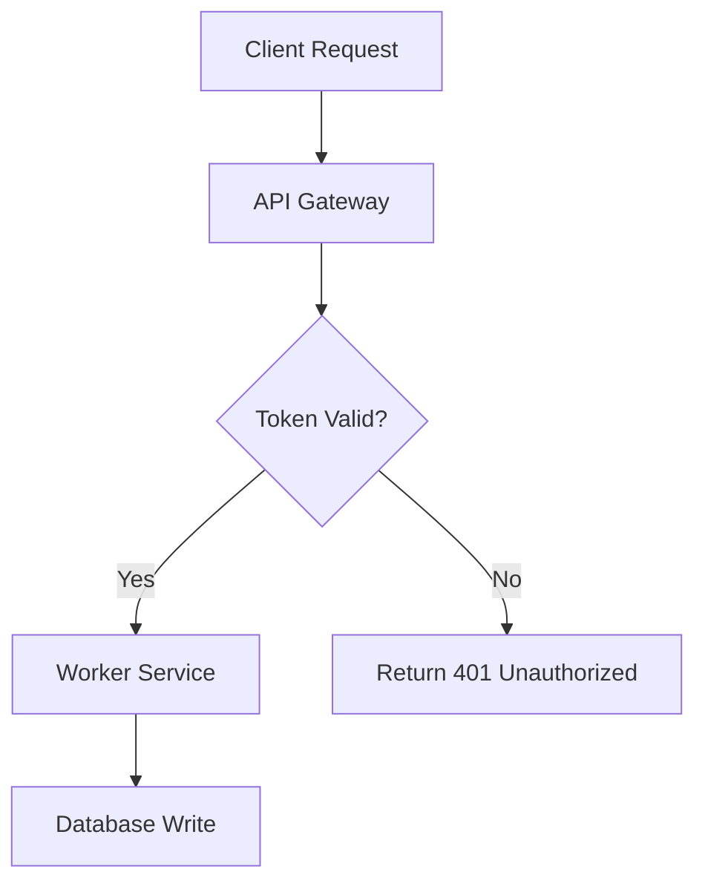

# ASD-STE100: Simplified Technical English & 80% Pragmatic Mode

A comprehensive skill for generating, transforming, and validating technical content using **ASD-STE100 (Simplified Technical English, Issue 8)** and Andrej Karpathy's **"80% Pragmatic Mode"**.

> *"Writing. Something I've had success with: Ask your LLM to explain something in ASD-STE100, it's a controlled language specification originally developed for aerospace maintenance documentation. LLMs are well-versed in this language and it comes with heavy constraints on clean writing style that I often find a lot more readable. Sometimes I've tried to soften it a bit e.g. ask for '80% of the way to ASD-STE100' because the spec is quite stringent..."*  
> — **Andrej Karpathy**

---

## 1. When to Use This Skill

Activate this skill when:
- The user requests an explanation or documentation in **ASD-STE100** or **Simplified Technical English**.
- The user asks for **"80% ASD-STE100"**, **"Karpathy-style writing"**, or **clean, low-cognitive-load explanations**.
- Complex architecture, code, algorithms, or system workflows must be parsed rapidly without ambiguity.
- You need to audit or lint existing documentation for passive voice, bloated sentences, or ambiguous words.
- The user wants multi-modal cognitive aids alongside STE (e.g., Mermaid diagrams, interactive HTML explainers, or 3b1b/Manim video scripts).

---

## 2. Core Philosophy & Modes

ASD-STE100 was created by aerospace manufacturers (ASD, formerly AECMA) to eliminate catastrophic maintenance errors caused by complex, ambiguous English. Its philosophy is:
- **One word, one meaning**: Avoid synonyms that create confusion.
- **Cognitive clarity**: Human working memory processes short, direct sentences up to 4x faster.
- **Zero ambiguity**: Eliminate vague qualifiers, passive constructions, and speculative modals.

### Mode Comparison: 100% Strict vs. 80% Pragmatic

| Rule Dimension | Strict Mode (100% ASD-STE100) | 80% Pragmatic Mode (Karpathy) [Default] |
| :--- | :--- | :--- |
| **Target Audience** | Aerospace, mission-critical hardware, ISO standard docs | Software engineers, AI researchers, general technical readers |
| **Sentence Length** | Procedural: ≤ 20 words Descriptive: ≤ 25 words | All sentences: target 15–22 words (absolute max 25 words) |
| **Voice** | Strict active voice only. Imperative for steps. | Active voice prioritized; direct subject-verb-object order. |
| **Ideas per Sentence** | Exactly 1 thought per sentence. | 1 primary idea per sentence. |
| **Vocabulary** | Strictly approved ASD-STE100 dictionary only. | Controlled English: replaces bureaucratic jargon with simple verbs, but allows standard modern tech terms (e.g. *API*, *container*, *latency*). |
| **Noun Clusters** | Max 3 consecutive nouns. | Max 3 consecutive nouns (break up with prepositions). |
| **Multi-modal Visuals** | Standard technical drawings/tables. | Pairs text with **Mermaid diagrams** or **Interactive HTML** widgets. |

---

## 3. The 9 Core Rules of ASD-STE100

The rule numbers below match the rule labels in the `/ste check` linter report.

### Rule 1: One Word, One Meaning (Approved Vocabulary)
Do not use different words for the same concept, and do not use unapproved words:
- **Use** (not *utilize*)
- **Stop** (not *terminate*, *abort*, *cease*)
- **Start** (not *commence*, *initiate*, *launch*)
- **Close** (not *shut*)
- **Change** (not *modify*, *alter*)
- **Before** (not *prior to*, *ahead of*)
- **After** (not *subsequent to*, *following upon*)
- **Because** (not *in view of the fact that*, *due to the reason that*)
- **If** (not *in the event that*, *provided that*)
- **And** (not *as well as*, *along with*)
- **To** (not *in order to*, *for the purpose of*)

### Rule 2: Sentence Length Limits
- **Strict, procedural (Instructions):** Maximum **20 words**.
- **Strict, descriptive (Explanations):** Maximum **25 words**.
- **80% Pragmatic:** Target 15–22 words. Hard cap of **25 words** for all sentences.
- If a sentence exceeds its limit, split it into two sentences immediately.

### Rule 3: One Thought per Sentence
Do not combine independent instructions or unrelated facts with semicolons or multiple coordinating conjunctions.
- ❌ *Incorrect:* "Turn off the server, disconnect the power cable, and then verify that the LED indicator has stopped blinking."
- ✔ *Correct (STE):*  
  1. Stop the server.
  2. Disconnect the power cable.
  3. Make sure that the LED indicator is off.

### Rule 4: Active Voice Only
Always specify the subject performing the action. Avoid passive forms (`is + past participle`).
- ❌ *Passive:* "The configuration parameters are verified by the daemon before the port is opened."
- ✔ *Active (STE):* "The daemon checks the configuration parameters. Then the daemon opens the port."

### Rule 5: Imperative Mood for Procedures
Start procedural steps with an action verb (base form):
- ✔ "Download the archive."
- ✔ "Extract the files to `/opt`."
- ✔ "Run the setup script."

### Rule 6: Limit Noun Clusters to Maximum 3 Words
Technical English often strings nouns together, causing severe comprehension bottlenecks.
- ❌ *Unacceptable cluster (6 nouns):* "airplane emergency brake hydraulic pressure accumulator valve"
- ✔ *Correct (STE):* "valve for the hydraulic pressure accumulator of the airplane emergency brake"
- In software: replace "user session timeout error handler configuration" with "configuration for handling user session timeout errors".

### Rule 7: Eliminate Ambiguous Modals & Vague Words
- **Banned:** *shall*, *should*, *could*, *might*, *ought to*, *etc.*, *and/or*, *adequate*, *properly*, *sufficiently*, *approximately*.
- Use direct directives: *must*, *can*, or specify exact conditions and numerical thresholds.

### Rule 8: Restrict Verb Tenses
ASD-STE100 permits only:
1. **Present simple** (*The process writes to disk.*)
2. **Past simple** (*The system sent the packet.*)
3. **Future simple with 'will'** (*The service will restart.*)
Avoid present perfect (*has processed*), continuous progressive (*is running* -> use *runs*), and conditional subjunctives. The linter flags these tenses in strict mode only.

### Rule 9: Tabulate and Format Multi-Item Information
Whenever there are more than two conditions or items, present them in a bulleted list or a table rather than an inline paragraph.

---

## 4. Karpathy's 4 Multimodal Artifact Modalities

In addition to ASD-STE100 writing, Andrej Karpathy highlighted that LLM outputs should leverage higher abstraction layers:

### Modality 1: Pure ASD-STE100 Text
Use for runbooks, architecture overviews, operational guidelines, and PR reviews. Clean, rapid, unambiguous.

### Modality 2: Diagrams (Mermaid)
Whenever a process involves 3 or more components or state transitions, include a Mermaid flowchart or sequence diagram:

### Modality 3: Interactive Web Pages (HTML)
When explaining dynamic systems, render an interactive single-file HTML component (inline widget or standalone artifact) with sliders, step-by-step playback, or live toggles.

### Modality 4: Explainer Video Storyboards & Scripts
Generate complete 3b1b (3Blue1Brown / Manim) animation scripts with voice narration markers formatted for Text-to-Speech (e.g. ElevenLabs):
- Scene breakdown (visual coordinate layout)
- Precise narration text (written in STE for clear pacing)
- Audio timing timestamps

---

## 5. Quick Transformation Reference Table

| Non-STE / Bloated English | ASD-STE100 (Strict) | 80% Pragmatic Mode (Karpathy) |
| :--- | :--- | :--- |
| *In order to utilize the database, it is necessary that authentication be performed prior to commencing queries.* | You must log in before you send queries to the database. | Log in before you query the database. Authentication is required. |
| *The worker pool should be terminated subsequent to the completion of all scheduled tasks.* | Stop the worker pool after all tasks finish. | Stop the worker pool after all tasks finish. |
| *Make sure the system is properly configured with an adequate number of replicas.* | Configure the system with at least 3 replicas. | Configure the system with at least 3 replicas to prevent downtime. |
| *The data was transmitted across the network by the client agent.* | The client agent sent the data across the network. | The client agent sent the data across the network. |

---

## 6. Execution Workflow for Agents

When requested to explain or rewrite a topic:
1. **Determine Mode:** Default to **80% Pragmatic Mode** unless the user specifies "100%", "strict", or aerospace compliance.
2. **Deconstruct the Core Concepts:** Identify the actors, actions, and sequence.
3. **Draft Sentences:** Keep each sentence under 22 words. Use active voice.
4. **Vocabulary Audit:** Check against unapproved words (*utilize* -> *use*, *prior to* -> *before*, *etc.* -> list explicitly).
5. **Add Visuals if Helpful:** Add a Mermaid diagram or interactive HTML widget for multi-step logic.
6. **Self-Check:** Verify against the 6-point checklist:
   - [ ] No sentence exceeds 25 words.
   - [ ] No passive voice.
   - [ ] Max 3 nouns in clusters.
   - [ ] One clear idea per sentence.
   - [ ] Simple, unambiguous verbs.
   - [ ] No fluff words (*it should be noted that*, *in order to*).
